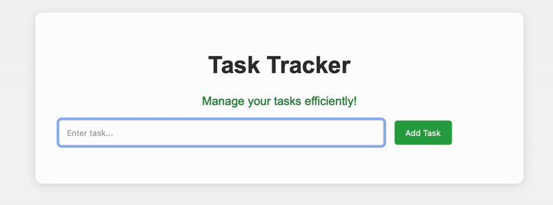

Overview

This "Task Tracker" is a simple, functional task management application built with HTML, CSS, and vanilla JavaScript. It allows users to quickly add, delete, with data persistence through localStorage.
This project demonstrates practical front-end development skills, including DOM manipulation, event handling, and state persistence, making it a useful example of real-world functionality that can be applied in various work contexts.

Features
Add tasks via input field and button or Enter key
Delete tasks individually with a delete button
Persistent storage so tasks remain on page reload

Why This Project is Useful

Even though this is a simple front-end project, it demonstrates core skills used in the workplace:
Task management UI: Similar to real-world dashboards and apps used in offices.
User interaction: Click and keyboard events, making the app responsive to user actions.
Data persistence: Demonstrates saving state for continuity, a skill important for web applications.
Clean, maintainable code: Easy to extend with more features like filtering, deadlines, or syncing with backend systems.

Future Enhancements

Add categories or priorities for tasks
Integrate with a backend or database for multi-user support
Add filtering and sorting (completed vs. pending tasks)
Implement drag-and-drop task reordering
